# Meta Lead Ads Flow (End-to-End)

This runbook explains how Meta Lead Ads integration works in this CRM, what must be configured, and how to debug "no leads received" incidents.

## 1) Architecture

```mermaid
flowchart LR
  LeadSubmit[User submits FB/IG lead form] --> MetaServers[Meta servers]
  MetaServers -->|"leadgen webhook event"| ApiWebhook["/api/integrations/webhooks/meta/"]
  ApiWebhook --> SignatureCheck["verify X-Hub-Signature-256 with META_CLIENT_SECRET"]
  SignatureCheck --> AccountMatch["match account by selected_form_id or selected_page_id"]
  AccountMatch --> LeadFetch["GET /{leadgen_id} with Page token + appsecret_proof"]
  LeadFetch --> ClientCreate["create Client + ClientPhoneNumber + ClientEvent"]
  ClientCreate --> Logs["IntegrationLog(action=lead_received)"]
```



Core backend files:
- `integrations/views/webhooks_messaging.py` (`meta_webhook`)
- `integrations/views/viewsets_accounts.py` (`sync_pages`, `lead_forms`, `select_lead_form`, `meta_health`)
- `integrations/oauth_utils.py` (`MetaOAuth`)

## 2) Required Meta App Setup

### 2.1 Products
- `Webhooks` (Page object)
- `Facebook Login for Business` (using `config_id`)

### 2.2 App-level webhook
In Meta App Dashboard:
1. Open `Webhooks` product.
2. Add subscription to `Page`.
3. Callback URL: `https://<api-domain>/api/integrations/webhooks/meta/`
4. Verify token: must match `META_WEBHOOK_VERIFY_TOKEN` from backend `.env`.
5. Subscribe to field: `leadgen`.

### 2.3 Permissions in Login for Business configuration
The integration expects these permissions:
- `pages_show_list`
- `pages_read_engagement`
- `pages_manage_metadata`
- `pages_manage_ads`
- `business_management`
- `leads_retrieval`

These are controlled by the Facebook Login for Business configuration referenced by `META_FACEBOOK_LOGIN_FOR_BUSINESS_CONFIG_ID`.

## 3) Required Backend Environment

Required variables:
- `META_CLIENT_ID`
- `META_CLIENT_SECRET`
- `META_REDIRECT_URI`
- `META_WEBHOOK_VERIFY_TOKEN`
- `META_FACEBOOK_LOGIN_FOR_BUSINESS_CONFIG_ID`
- `API_BASE_URL` (used to build callback URL diagnostics)

Webhook verification and signature:
- GET challenge uses `META_WEBHOOK_VERIFY_TOKEN`.
- POST signature uses `META_CLIENT_SECRET`.

## 4) Required CRM Account State (per company)

A Meta integration account must have:
- `status = connected`
- valid user access token
- `metadata.pages` with page ids and page access tokens
- selected mappings from `select_lead_form`:
  - `metadata.selected_page_id`
  - `metadata.selected_form_id`
  - optional `metadata.form_campaign_mapping[form_id] = campaign_id`

When `select_lead_form` is called, backend now auto-subscribes the selected page to `leadgen` and stores subscription result in `IntegrationLog(action='meta_page_subscribed')`.

## 5) Page subscription requirement (`subscribed_apps`)

Meta only sends lead webhooks if the app is subscribed at page level.

This project now performs best-effort auto-subscribe:
- During `POST /api/integrations/accounts/{id}/select_lead_form/`
- During `POST /api/integrations/accounts/{id}/sync-pages/`

Manual fallback call:

```bash
POST /{page-id}/subscribed_apps?subscribed_fields=leadgen
```

Use Page access token (+ appsecret proof when required).

## 6) Debug workflow (recommended order)

1. Verify webhook GET challenge works.
2. Check Meta account token validity (`test-connection` or `meta-health`).
3. Confirm selected page/form in CRM matches ad page/form.
4. Confirm page is subscribed to app for `leadgen`.
5. Submit a real test lead from Ads Manager.
6. Check server logs and `IntegrationLog`.

## 7) New diagnostics endpoint

Endpoint:
- `GET /api/integrations/accounts/{id}/meta-health/`

Optional one-click fix:
- `GET /api/integrations/accounts/{id}/meta-health/?subscribe=1`

Returns:
- token validity/scopes
- webhook config flags
- selected page/form and mapping checks
- per-page status (`app_installed`, `leadgen_subscribed`, token availability)
- recent activity (`leads_last_7d`, `errors_last_7d`, last lead timestamp)

Frontend exposes this through **Check Meta Health** button in Integrations page.

## 8) Log lines and meaning

From `meta_webhook`:
- `META_WEBHOOK_CALLED method=POST`
  - Meta reached your endpoint.
- `META_WEBHOOK POST signature valid`
  - Signature and app secret match.
- `META_WEBHOOK processing leadgen: leadgen_id=... form_id=... page_id=...`
  - Payload parsed correctly.
- `Found account by form_id` / `Found account by page_id`
  - Account mapping succeeded.
- `No integration account found for form_id=..., page_id=...`
  - Selected form/page mismatch in CRM.
- `Failed to get page access token` or `Failed to get lead data`
  - Token/permission issue.
- `META_WEBHOOK: plan quota blocked lead creation`
  - Plan limit prevented client creation.
- `Successfully created client from Meta lead`
  - End-to-end success.

## 9) Common failure causes

1. Page not subscribed to app for `leadgen`.
2. Wrong selected form/page in CRM.
3. Expired or revoked access token.
4. Missing required Meta permissions.
5. App in development mode (non-test users cannot send real events).
6. Tenant plan quota limit reached.

## 10) Useful test script

Use:
- `test_meta_webhook_post.py`

Purpose:
- sends a signed webhook payload to validate endpoint reachability and signature logic.

Note:
- Script success does not prove Meta page subscription state. Use `meta-health` for that.
